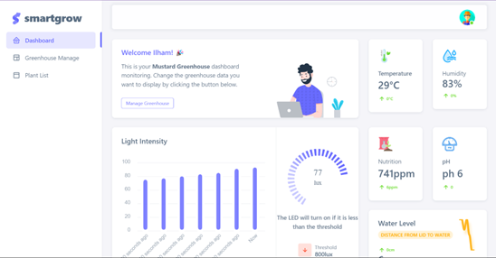

# 🌿 Green House App

Green House is a web-based application for **plant management** and **planting planning**, built with the **Laravel** framework.


---

## ✨ Features

- 🔐 User Authentication (Login & Register)
- 🌾 Plant CRUD
- 📅 Planting Plan Management
- 🗂️ Seeder for Plant Data
- ⚙️ Laravel Backend with Blade Templates
- 📦 Clean and Modular Structure

---

## 📁 Main Folder Structure

| Folder        | Description                           |
|---------------|----------------------------------------|
| `app/`        | Application logic (controllers, models) |
| `routes/`     | Web routes definition (`web.php`)       |
| `resources/`  | Blade templates and frontend assets     |
| `database/`   | Migrations and seeders                  |
| `public/`     | Web root folder and entry point         |

---

## 🛠️ Installation (Local)

```bash
git clone https://github.com/IlhamNur/green-house.git
cd green-house

# Install dependencies
composer install
cp .env.example .env
php artisan key:generate

# Run migrations and seeders
php artisan migrate --seed

# Start the local server
php artisan serve
```

---

## 🧠 Tech Stack

- **Backend**: Laravel 12
- **Frontend**: Blade, SCSS, JavaScript
- **Database**: MySQL
- **Auth**: Laravel Auth

---

## 📸 Screenshots

### 🏠 Dashboard


---

## 🙋 About the Developer

**Ilham Nur Romdoni**  
🔖 Personal brand: `hmnr`  
📬 [LinkedIn](https://linkedin.com/in/ilham-nur-romdoni-167263206) • 📩 romdhoninuril@gmail.com

---

Feel free to fork or star this repository if you find it useful!
